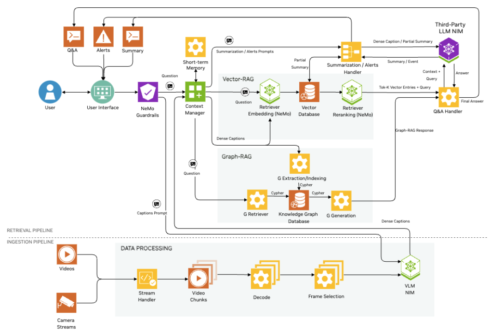

# Introduction to VSS

Now that the services are up and running, we can learn how to integrate VSS into our custom applications. This is achieved via the API. In this exercise, we will review the structure of the API and observe how the API works.

<!-- fold:break -->

## Architecture
The Video Search and Summarization comprises two pipelines: the **Ingestion** pipeline and the **Retrieval** pipeline.

As video is streamed or uploaded into the agent, the video will be pre-processed into chunks of time intervals. These chunks are then used to generate high level summaries as well as a detailed database of observations. This is the Ingestion Pipeline.

The combination of these chunked summaries and knowledge database are then used by the Retrieval pipeline to summarize and chat with video streams.

For more info on these pipelines, reference the [Context Aware RAG Integration](https://via.gitlab-master-pages.nvidia.com/via-docs/content/context_aware_rag.html) docs.

<!-- fold:break -->

## Meet NIM

This Blueprint employs four NVIDIA NIM microservices.

<table>

  <tr>
    <td><a href="https://build.nvidia.com/nvidia/vila" target="_blank"><i class="fas fa-external-link-alt"></i> nvidia/vila</a></td>
    <td>Vision Language Model</td>
  </tr><tr>
    <td colspan=2>Examines the incoming video and extracts key insights.</td>
  </tr>

  <tr>
    <td><a href="https://build.nvidia.com/meta/llama-3_3-70b-instruct" target="_blank"><i class="fas fa-external-link-alt"></i> meta/llama-3.3-70b-instruct</a></td>
    <td>Large Language Model</td>
  </tr><tr>
    <td colspan=2>Orchestrates retrieval and chats directly with the end user.</td>
  </tr>

  <tr>
    <td><a href="https://build.nvidia.com/nvidia/nv-embedqa-e5-v5" target="_blank"><i class="fas fa-external-link-alt"></i> nvidia/nv-embedqa-e5-v5</a></td>
    <td>Embedding Model</td>
  </tr><tr>
    <td colspan=2>Encodes information for storage in the vector database during ingestion. During retrieval, is used to similarly encode the user's question.</td>
  </tr>

  <tr>
    <td><a href="https://build.nvidia.com/nvidia/llama-3_2-nv-rerankqa-1b-v2" target="_blank"><i class="fas fa-external-link-alt"></i> nvidia/llama-3_2-nv-rerankqa-1b-v2</a></td>
    <td>Reranking Model</td>
  </tr><tr>
    <td colspan=2>Sorts database search results by relevancy.</td>
  </tr>

</table>

<!--fold:break -->

## Explore the API

We will get started by using a Jupyter Notebook to send requests to the Video Insights Agent's API. An OpenAPI specification for this API is available, and the API can be browsed, at
{{#isBrev}}
https://api0-{{brevId}}.brevlab.com/docs
{{/isBrev}}
{{^isBrev}}
http://{{ hostname }}:8100/docs
{{/isBrev}}

Open <button onclick="openOrCreateFileInJupyterLab('code/Intro_To_VSS.ipynb');"><i class="fas fa-flask"></i> code/Intro_To_VSS.ipynb</button> to get started.

<!--fold:break -->

## Wrap up

In that exercise, we created a functional system that can help to improve safety in a warehouse.
We did this with three pretty quick steps:

1. Gather server information (health + models)
1. Upload the video file
1. Create custom prompts to define behavior

Once that was complete, the VSS Blueprint's Summarization APIs generated a summary that was that outlined the major events.
We also used those APIs to chat with the video file to perform a net new analysis.

Very cool! In the next exercise, we will dig deeper into the other parameters that can be tuned.
